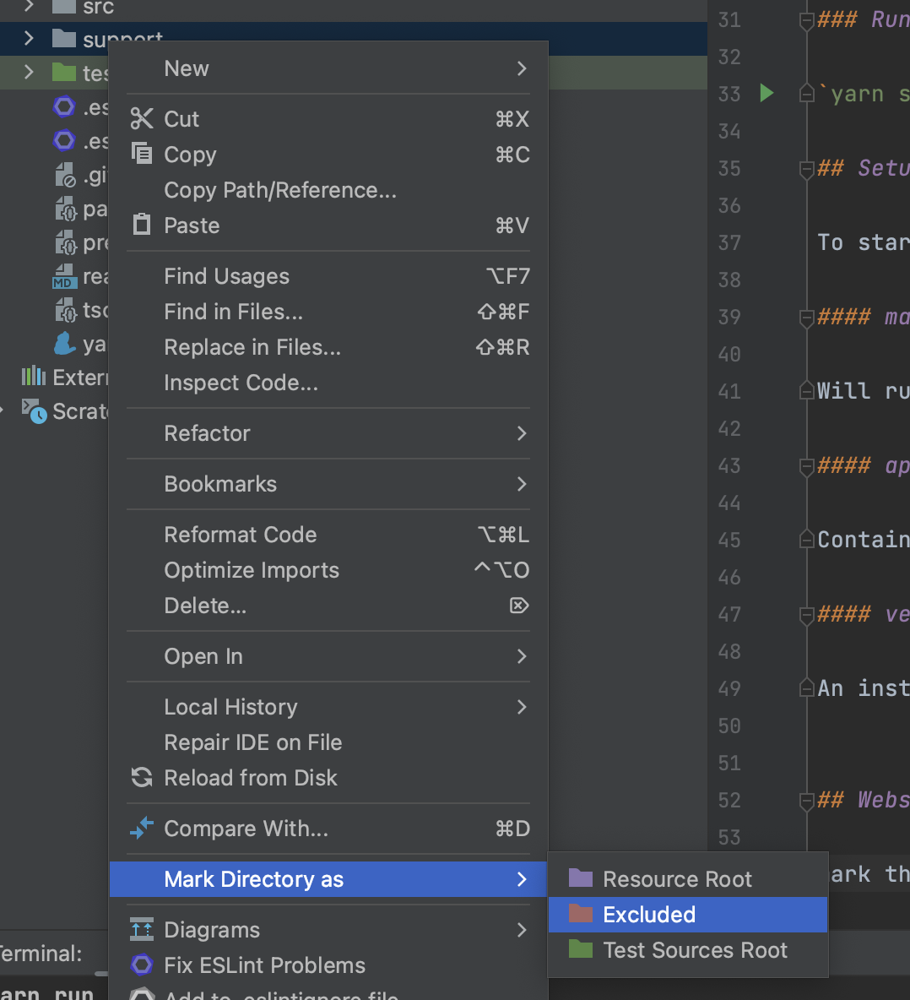

# Vending Machine KATA!

This is a kata based on a simple vending machine problem in typescript.

It will train you to write tests before implementation of the code.

## Kata Instructions

you can run the following command to reset the working space to a clean version.

`yarn code:reset`

Start with the [first step](support/kata_instructions/step-1.md)

### Install

`yarn install`

### Build

`yarn build`

### Test

`yarn test`

### Run

`yarn start`

## Setup

To start, we have 3 files:

#### main.ts

Will run the application, can be ignored or used to run a full integration test.

#### app.ts

Contains the command structure of the code, here you will write the commands to execute against the application

#### vendingMachine.ts

An instance of the vendingMachine, where we will implement methods we can call to do things against the vending machine.

## Webstorm IDE tips:

mark the `./support` & `./dist` folders as `Excluded` and the `./test` as `Test Sources Root` so you don't 
end up searching over them:

