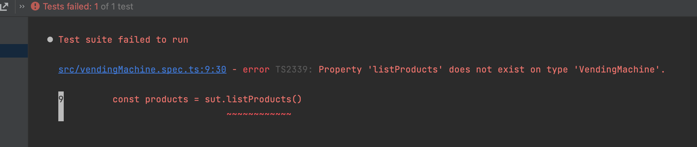
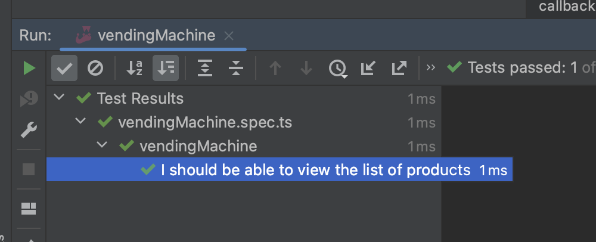

## Step 1: Listing products

_learning: create a test before implementing any functionality_

How do we know what's in the vending machine?! I wanna see the cool stuff! Let's implement functionality
to view a list of 3 items that are available: 'chocolate', 'chips' and 'yfood'.


### Write the test first!

vendingMachine.spec.ts
```typescript
describe('vendingMachine', () => {
    const sut = new VendingMachine()
    it('I should be able to view the list of products', () => {
        // -- Arrange

        // -- Act
        const products = sut.listProducts()

        // -- Assert
        expect(products).toBeDefined()
        expect(products.length).toBeGreaterThan(0)
        expect(products).toContain('chocolate')
        expect(products).toContain('chips')
        expect(products).toContain('yfood')
    });
});
```

### See the test fail!



### Implement the method

vendingMachine.ts
```typescript
export class VendingMachine {
    public listProducts(): string[] {
        return ['chocolate', 'chips', 'yfood']
    }
}
```


### See the test pass




## Onwards

[Continue with step 2](2_pricing.md)
