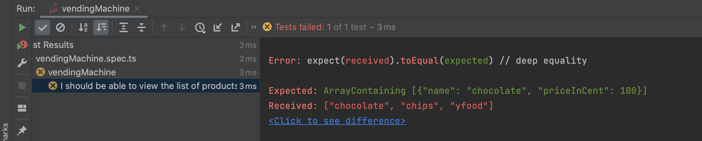
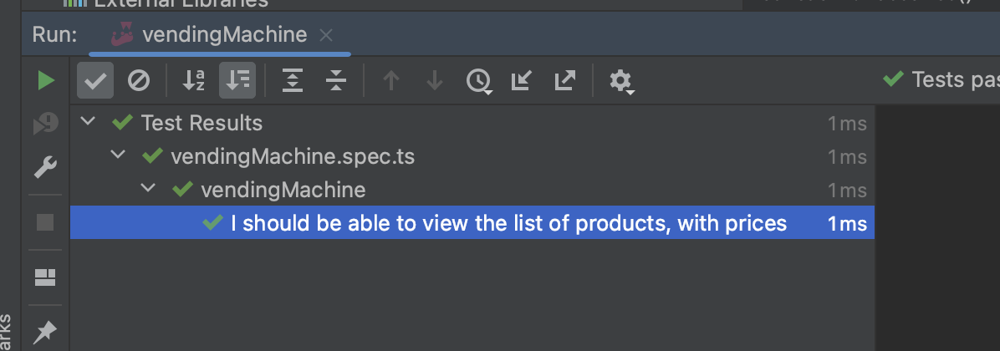

## Step 2: Get prices

_learning: refactor the test before implementing the method_

_learning: create an interface for the return type of a function_

It's great we now have the products, but... wait? where are the prices? We are here to make money! Time to add some prices.

### Write the test first!

vendingMachine.spec.ts

```typescript
describe('vendingMachine', () => {
    const sut = new VendingMachine()
    it('I should be able to view the list of products, with prices', () => {
        // -- Arrange

        // -- Act
        const products = sut.listProducts()

        // -- Assert
        expect(products).toBeDefined()
        expect(products.length).toEqual(3)
        expect(products).toEqual(expect.arrayContaining([{name: 'chocolate', priceInCent: 100}]))
        expect(products).toEqual(expect.arrayContaining([{name: 'chips', priceInCent: 120}]))
        expect(products).toEqual(expect.arrayContaining([{name: 'yfood', priceInCent: 399}]))
    });
});
```

### See the test fail!



### Implement the method!

As we are not returning a simple array of products anymore, we introduce the interface 'Product' to our system


models/product.interface.ts
```typescript
export interface Product {
    name: string,
    priceInCent: number
}
```

Now we have our model, let's implement the code that will return the Products[]


vendingMachine.ts
```typescript
export class VendingMachine {
    public listProducts(): Product[] {
        return [
            {
                name: 'chocolate',
                priceInCent: 100
            },
            {
                name: 'chips',
                priceInCent: 120
            },
            {
                name: 'yfood',
                priceInCent: 399
            },

        ]
    }
}
```

### See the test pass



## Onwards!

[Continue with step 3](3_stock.md)