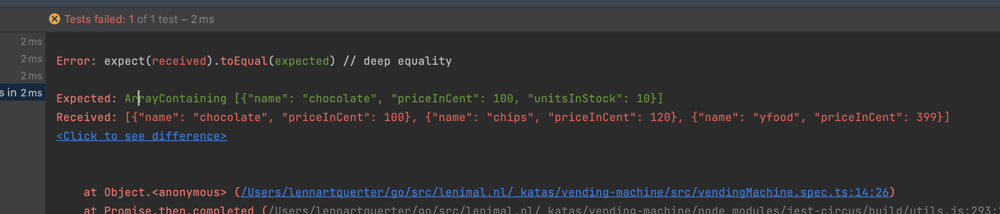
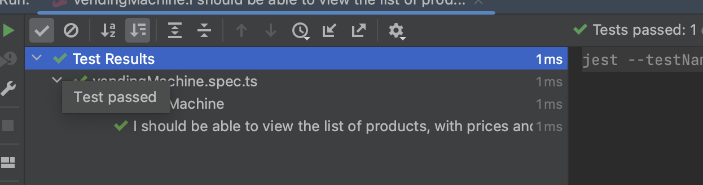

# Step 3

_learned: adding attributes to interfaces_

Okay, cool, we are now not giving away things for free! That's good. but... 
How much inventory do we have of each product? Is it infinity? No. Probably not. 
Let's add a simple way to manage our stock for each item.

### Write the expected outcome

```typescript

describe('vendingMachine', () => {
    const sut = new VendingMachine()
    it('I should be able to view the list of products, with prices and units in stock', () => {
        // -- Arrange

        // -- Act
        const products = sut.listProducts()

        // -- Assert
        expect(products).toBeDefined()
        expect(products.length).toEqual(3)
        expect(products).toEqual(expect.arrayContaining([{name: 'chocolate', priceInCent: 100, unitsInStock: 10}]))
        expect(products).toEqual(expect.arrayContaining([{name: 'chips', priceInCent: 120, unitsInStock: 10}]))
        expect(products).toEqual(expect.arrayContaining([{name: 'yfood', priceInCent: 399, unitsInStock: 10}]))
    });
});

```

### See the test Fail



### Implement the attributes


```typescript
export interface Product {
    name: string,
    priceInCent: number
    unitsInStock: number
}
```

### Implement the code

```typescript


export class VendingMachine {
    public listProducts(): Product[] {
        return [
            {
                name: 'chocolate',
                priceInCent: 100,
                unitsInStock: 10,
            },
            {
                name: 'chips',
                priceInCent: 120,
                unitsInStock: 10,
            },
            {
                name: 'yfood',
                priceInCent: 399,
                unitsInStock: 10,
            },

        ]
    }
}

```

### See the test Pass



## Onwards!

[Continue to step 4](./step-4.md)