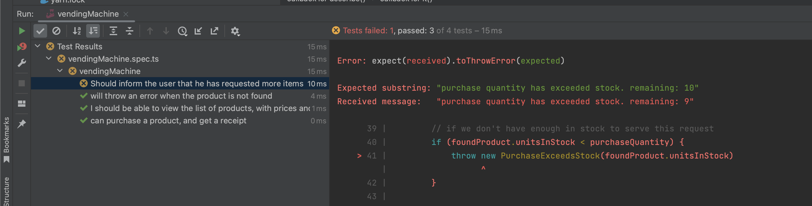

# Step 4

_learned: refactoring to internal properties_

Now that we can get a list, see the price & know the stock, it is time
to actually buy something from our vending machine. When someone does a purchase, they expect
to get a receipt of the purchased item, the price and quantity.

Let's see how we can easily write a test, and refactor our code so it keeps working at all times.


### Write the expected outcome

```typescript

it('can purchase a product, and get a receipt', () => {
        // -- Arrange

        // -- Act
        const receipt = sut.purchaseProduct(1, 'chocolate')

        // -- Assert
        expect(receipt).toBeDefined()
        expect(receipt.priceInCent).toEqual(100)
        expect(receipt.quantityPurchased).toEqual(1)
    })


```

### See the test Fail


### Implement the code

Now this gets interesting, we are going to have to create some new models, and move some code to a higher
level. Let's start by creating the receipt model, so we can use it in our response.

```typescript
export interface Receipt {
    productName: string,
    priceInCent: number
    quantity: number
}
```

And we can now implement the function in the code:

```typescript

export class VendingMachine {
    // [...]
    public purchaseProduct(number: number, chocolate: string): Receipt {

    }
}
```

As we want to be able to manage our vending-machine stock, we need to move the products
into a private variable so we can access it in both the list and purchase function.


```typescript
export class VendingMachine {
    private productList: Product[] = [
        {
            name: 'chocolate',
            priceInCent: 100,
            unitsInStock: 10,
        },
        {
            name: 'chips',
            priceInCent: 120,
            unitsInStock: 10,
        },
        {
            name: 'yfood',
            priceInCent: 399,
            unitsInStock: 10,
        },

    ]

    public listProducts(): Product[] {
        return this.productList
    }

    public purchaseProduct(number: number, chocolate: string): Receipt {
        // to prevent build-time errors
        return {
            priceInCent: 0,
            productName: "",
            quantity: 0
        }
    }
}
```

Let's run the test again for listProducts and see if the result is the same as we expect it to be:


Hoera! We have not broken anything related to viewing the products! We did good!


Now, time to implement the code where we get the product by name, reduce the quantity, and return the receipt:

```typescript

export class VendingMachine {

    public purchaseProduct(purchaseQuantity: number, productName: string): Receipt {
        const foundProduct = this.productList.find(product => product.name === productName)

        // throw an error if we don't find this product
        if (foundProduct == null) {
            throw new ProductNotFound(productName)
        }

        // reduce the stock by 1
        foundProduct.unitsInStock -= purchaseQuantity

        // to prevent build-time errors
        return {
            priceInCent: foundProduct.priceInCent,
            productName: foundProduct.name,
            quantity: purchaseQuantity
        }
    }
}
```

We had to introduce an error here, we prefer not to directly throw a `new Error()` but build up proper error handling so the upstream services
can check for specificy type of errors. We will build a different test to check for this error.

expections/productNotFound.exception.ts
```typescript
export class ProductNotFound extends Error {
    constructor(productName: string) {
        super(`no product found with name ${productName}`);
    }
}
```

Hoera! Our test passes now!


But... Did we test all the edge-cases? How do we know that the error 
will be thrown once we pass in the wrong data? Well... only 1 way to find out! Write a test:

```typescript
it('will throw an error when the product is not found', () => {
    // -- Arrange
    // -- Act
    // -- Assert
    expect(() => sut.purchaseProduct(1, 'product-not-found')).toThrowError(ProductNotFound)
})
```

Great! We now know that an error will be thrown if we can not find a product


But you know what, we actually forgot something. Think about the user flow of a vending
machine. What happens if we try to get more out of the machine than available? Ohno, this does not sound promisisng.

Let's write a test!

```typescript
it('Should not sell more items than we have availble', () => {
    // -- Arrange
    // -- Act
    const receipt = sut.purchaseProduct(100, 'chocolate')
    
    // -- Assert
    expect(receipt).toBeDefined()
    expect(receipt.priceInCent).toEqual(100)
    expect(receipt.quantity).toEqual(10)
    expect(receipt.productName).toEqual('chocolate')
})
```

As we run the test, we see that it does not pass, we actually sell the full 100 pieces of chocolate! But we only expected to sell 10!

Back to the code. What do we expect? What do you as a user expect? My personal expectation is that I would get an error message telling
me the maximum remaining quantity I can get from the machine. 

Let's rewrite the test to match those expectations.

```typescript
it('Should inform the user that he has requested more items than available, with the remaining quantity', () => {
    // -- Arrange
    const errorFn = () => sut.purchaseProduct(100, 'chocolate')
    // -- Act
    // -- Assert
    expect(errorFn).toThrowError(PurchaseExceedsStock)
    expect(errorFn).toThrowError('purchase quantity has exceeded stock. remaining: 10')
})
```

Ofcourse we need to see this fail, this won't even build! We need to first add the error class.


expections/purchaseExceedsStock.exception.ts
```typescript
export class PurchaseExceedsStock extends Error {
    constructor(available: number) {
        super(`purchase quantity has exceeded stock. remaining: ${available}`);
    }
}
```

now at least our code builds! But when we run our test, it fails:


Let's go and implement the code!

```typescript
export class VendingMachine {
    public purchaseProduct(purchaseQuantity: number, productName: string): Receipt {
        const foundProduct = this.productList.find(product => product.name === productName)

        // throw an error if we don't find this product
        if (foundProduct == null) {
            throw new ProductNotFound(productName)
        }

        // if we don't have enough in stock to serve this request
        if (foundProduct.unitsInStock < purchaseQuantity) {
            throw new PurchaseExceedsStock(foundProduct.unitsInStock)
        }

        // reduce the stock by 1
        foundProduct.unitsInStock -= purchaseQuantity

        // to prevent build-time errors
        return {
            priceInCent: foundProduct.priceInCent,
            productName: foundProduct.name,
            quantity: purchaseQuantity
        }
    }
}
```

[If you get an error, keep reading before jumping to conclusions!]

Let's run our test!


Everything seems perfect! But wait... let's try to run the whole test suite, something is off...



Why does this not work? Well.. Because we are initializing our class at the top of our tests... and if you read the tests top to bottom, 
you can see that we have already purchases one piece of chocolate! Our test is flaky, it succeeds in isolation, but does not as a whole.

There is an easy fix for this (for now, we will come back to this in a following module) where we re-create the class before EVERY test.

We use the jest functionality `beforeEach` for this. Add this before all tests:

```typescript

describe('vendingMachine', () => {
    let sut: VendingMachine

    beforeEach(() => {
        sut = new VendingMachine()
    })
    
    // [...]
})
```

This will make sure we have a NEW version of the vendingMachine each time we want to test something!

_Later we will see how to actually prevent this from happening, maybe even try to abstract our stock-management system and mock it out_

### See the test Pass


## Onwards!

[Continue to step 5](./5_better-stock-management.md)